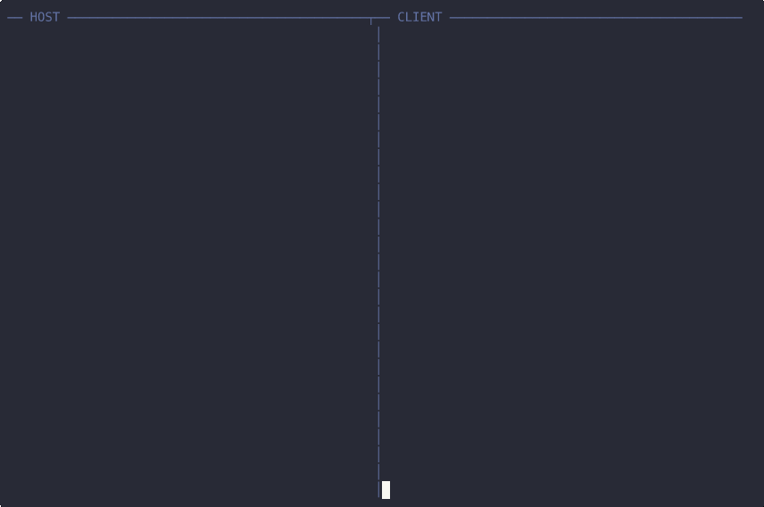
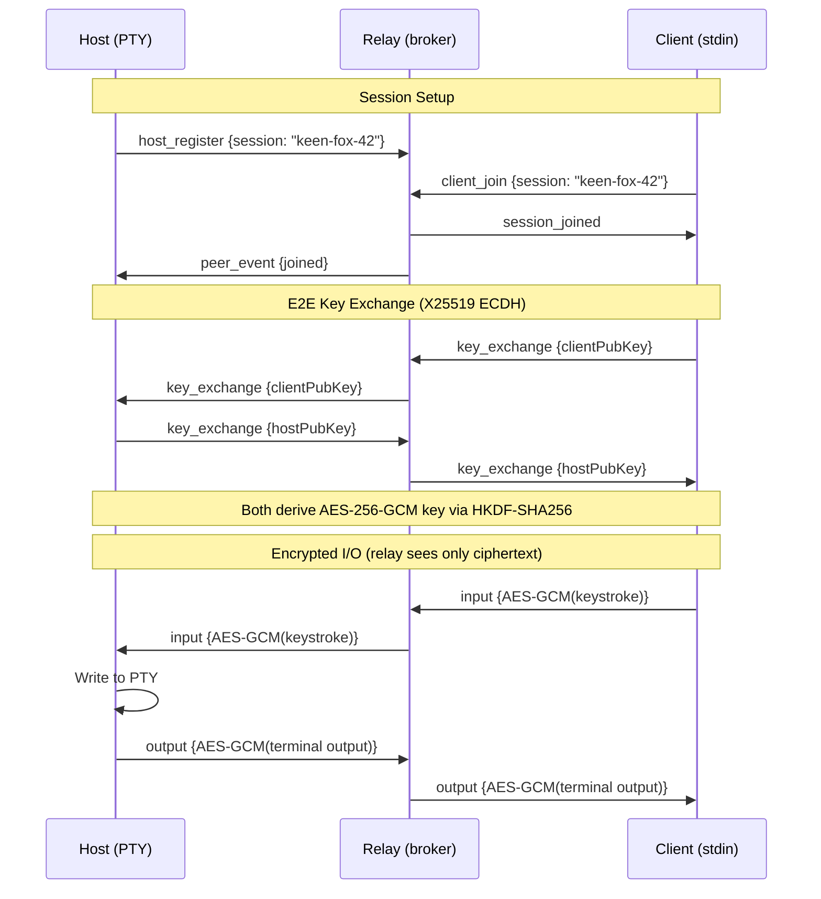

<p align="center">
  
</p>

<h1 align="center">keytun</h1>

<p align="center">
  <strong>Think ngrok, but for keystrokes.</strong><br/>
  <sub>Let your colleague type into your terminal over a screenshare — no screen control handoff needed.</sub>
</p>

<p align="center">
  <a href="#why">Why</a> •
  <a href="#install">Install</a> •
  <a href="#quick-start">Quick start</a> •
  <a href="#commands">Commands</a> •
  <a href="#security">Security</a> •
  <a href="https://keytun.com">Website</a>
</p>

<p align="center">     </p>

---

<p align="center"></p>

```
you@laptop:~$ keytun host
  Session:  keen-fox-42
  Join:     https://keytun.com/s/keen-fox-42
  Waiting for client...

  ✓ Client connected (end-to-end encrypted)
```

## Why

You're pair programming over a screenshare. Your colleague spots a bug and wants to show you a fix. Today your options are:

- **Dictate keystrokes** — *"no, backtick, not single quote... up, up, no the other up"*
- **Hand over screen control** — laggy, clunky, and you lose your place
- **Push-and-pull through git** — for a one-line change? Really?

With keytun, they just open a link and start typing. You both see the same terminal. No installs on their end, no screen control, no lag.

## Features

- **Single binary** — download and run, no runtime or dependencies
- **Browser join** — your colleague clicks a link, no install needed
- **End-to-end encrypted** — X25519 + AES-256-GCM; the relay can't read a thing
- **Readable session codes** — `keen-fox-42`, not `a]3Kx9$f`
- **Multiple clients** — the whole team can join the same session
- **Self-hostable** — run your own relay with `keytun relay` or Docker
- **System mode** — inject keystrokes into any app, not just the terminal (macOS)

## Install

### Shell (macOS / Linux)

```bash
curl -fsSL https://keytun.com/install.sh | sh
```

### Homebrew (macOS)

```bash
brew install gboston/tap/keytun
```

### From source

```bash
go install github.com/gboston/keytun@latest
```

## Quick start

**Host** (you):
```bash
keytun host
```

**Client** (your colleague) — pick one:
```bash
keytun join keen-fox-42                     # CLI
open https://keytun.com/s/keen-fox-42       # or just open the link in a browser
```

That's it. Your colleague is now typing into your terminal.

### Self-hosted relay

Don't want to use the public relay? Run your own:

```bash
keytun relay --port 8080                              # start relay
keytun host --relay ws://localhost:8080/ws             # host with your relay
keytun join keen-fox-42 --relay ws://localhost:8080/ws  # join via your relay
```

Or use Docker:
```bash
docker build -t keytun . && docker run -p 8080:8080 keytun
```

## Commands

### `keytun relay`

Starts the WebSocket relay broker.

```
--port, -p    Port to listen on (default: 8080)
```

### `keytun host`

Hosts a session and shares a session code with your colleague.

```
--relay       Relay server URL (default: wss://relay.keytun.com/ws)
--mode        Injection mode: "terminal" or "system" (default: terminal)
--target      Target app name for system mode, e.g. "TextEdit" (macOS only)
```

**Terminal mode** spawns a PTY with your shell — the remote user sees and types into a full terminal session.

**System mode** injects keystrokes at the OS level into the focused application (macOS only).

### `keytun join <session-code>`

Joins an existing session. Press Escape twice to disconnect.

```
--relay       Relay server URL (default: wss://relay.keytun.com/ws)
```

## Security

All data between host and client is end-to-end encrypted. The relay only sees opaque ciphertext.

| Layer | Algorithm |
|-------|-----------|
| Key exchange | X25519 ECDH |
| Encryption | AES-256-GCM |
| Key derivation | HKDF-SHA256 |

The relay is a dumb pipe — it cannot read keystrokes or terminal output.

## How it works



1. The **host** starts a session and gets a human-readable code (e.g. `keen-fox-42`)
2. The **client** joins using that code — via CLI or browser
3. An end-to-end encrypted channel is established (the relay never sees plaintext)
4. Keystrokes flow to the host's terminal, output flows back — in real time

## Development

Requires [Go](https://go.dev/) 1.25+ and [just](https://github.com/casey/just) (install via `mise install`).

```bash
just build    # Compile binary to ./keytun
just test     # Run all tests
just clean    # Remove compiled binary
```

## License

[AGPL-3.0](LICENSE)
