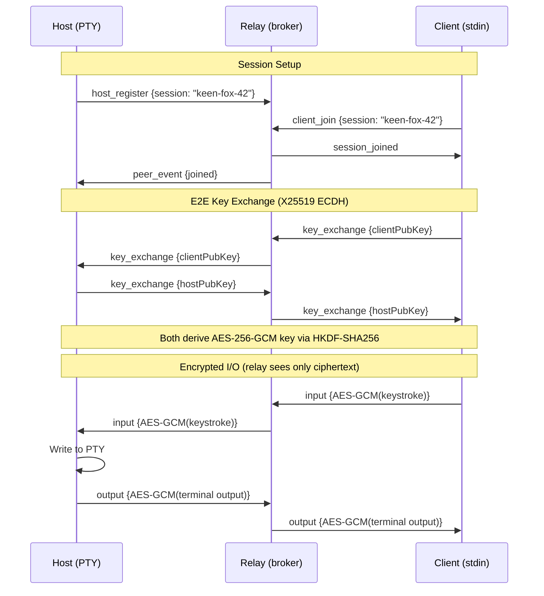

<p align="center">
  
</p>

<h1 align="center">keytun</h1>

<p align="center">
  <strong>Think ngrok, but for keystrokes.</strong><br/>
  <sub>Let your colleague type into your terminal over a screenshare.</sub>
</p>

<p align="center">
  <a href="#install">Install</a> •
  <a href="#quick-start">Quick start</a> •
  <a href="#commands">Commands</a> •
  <a href="#security">Security</a> •
  <a href="https://keytun.com">Website</a>
</p>

<p align="center">     </p>

---



1. The **host** starts a session and gets a human-readable code (e.g. `keen-fox-42`)
2. The **client** joins using that code
3. Keystrokes flow through the relay to the host's terminal, output flows back
4. All data is encrypted end-to-end — the relay is a dumb pipe that cannot read keystrokes or terminal output

## Install

### Shell (macOS / Linux)

```bash
curl -fsSL https://keytun.com/install.sh | sh
```

### Homebrew (macOS)

```bash
brew install gboston/tap/keytun
```

### From source

```bash
go install github.com/gboston/keytun@latest
```

## Quick start

```bash
# Host a session (uses relay.keytun.com by default)
keytun host

# Join the session (use the code from the host output)
keytun join keen-fox-42
```

### Join from the browser

Your colleague doesn't need to install anything. When you run `keytun host`, it prints a direct join link:

```
Join:    https://keytun.com/s/keen-fox-42
```

Share that URL and they can type into your terminal straight from their browser.
You can also go to [keytun.com/join](https://keytun.com/join) and enter a session code manually.

### Local relay

To use a local relay instead of the default:

```bash
keytun relay --port 8080
keytun host --relay ws://localhost:8080/ws
keytun join keen-fox-42 --relay ws://localhost:8080/ws
```

## Commands

### `keytun relay`

Starts the WebSocket relay broker.

```
--port, -p    Port to listen on (default: 8080)
```

### `keytun host`

Hosts a session and shares a session code with your colleague.

```
--relay       Relay server URL (default: wss://relay.keytun.com/ws)
--mode        Injection mode: "terminal" or "system" (default: terminal)
--target      Target app name for system mode, e.g. "TextEdit" (macOS only)
```

**Terminal mode** spawns a PTY with your shell — the remote user sees and types into a full terminal session.

**System mode** injects keystrokes at the OS level into the focused application (macOS only).

### `keytun join <session-code>`

Joins an existing session. Press Escape twice to disconnect.

```
--relay       Relay server URL (default: wss://relay.keytun.com/ws)
```

## Security

All data between host and client is end-to-end encrypted. The relay only sees opaque ciphertext.

| Layer | Algorithm |
|-------|-----------|
| Key exchange | X25519 ECDH |
| Encryption | AES-256-GCM |
| Key derivation | HKDF-SHA256 |

The relay is a dumb pipe — it cannot read keystrokes or terminal output.

## Development

Requires [Go](https://go.dev/) 1.25+ and [just](https://github.com/casey/just) (install via `mise install`).

```bash
just build    # Compile binary to ./keytun
just test     # Run all tests
just clean    # Remove compiled binary
```

## Releasing

Releases are automated via [GoReleaser](https://goreleaser.com/) and GitHub Actions.

1. Add an entry in `CHANGELOG.md`
2. Commit and tag:
   ```bash
   git add -A && git commit -m "release: v0.X.Y"
   git tag v0.X.Y
   git push origin main --tags
   ```
3. The `release.yml` workflow triggers on the `v*` tag push and:
   - Builds macOS binaries (arm64 + amd64) with CGO disabled
   - Creates a GitHub Release with the binaries and checksums
   - Updates the Homebrew cask in `gboston/homebrew-tap`

### Secrets required

| Secret | Purpose |
|--------|---------|
| `GITHUB_TOKEN` | Auto-provided by Actions, used for the GitHub Release |
| `HOMEBREW_TAP_GITHUB_TOKEN` | PAT with write access to `gboston/homebrew-tap` |

## License

AGPL-3.0
